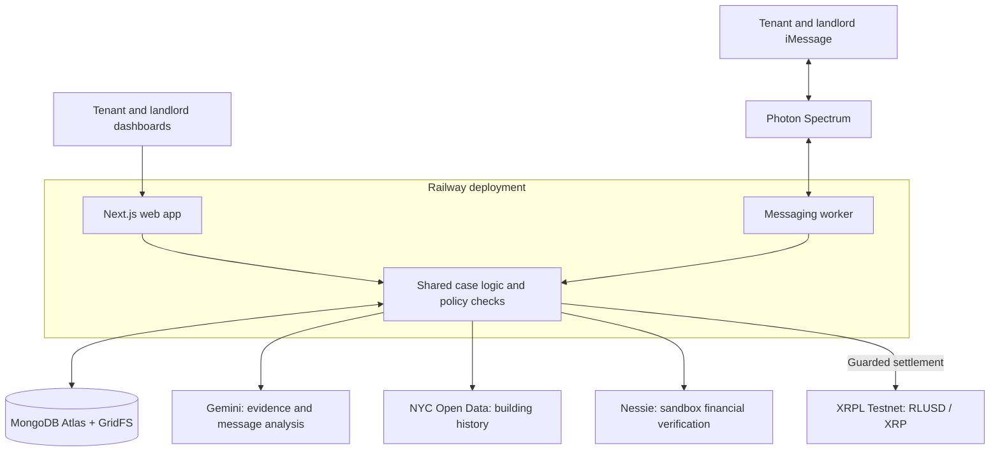
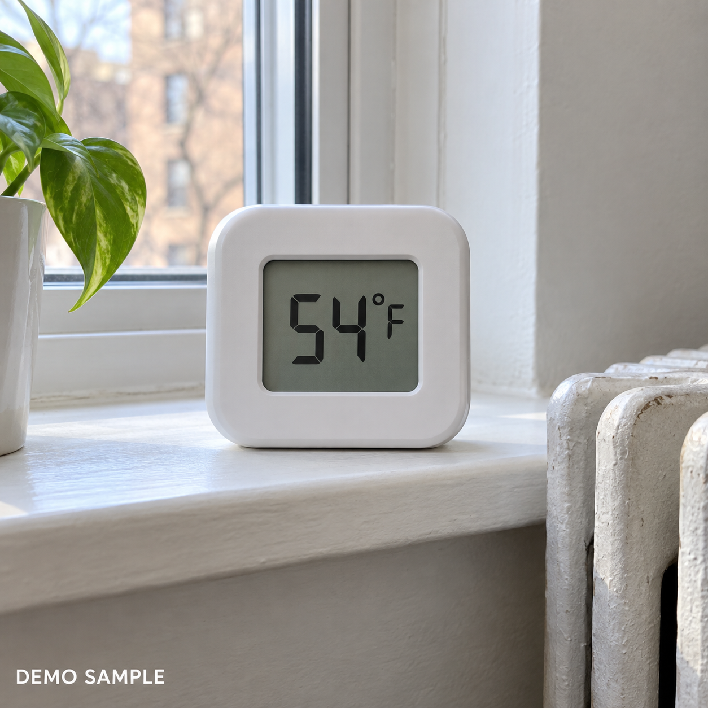
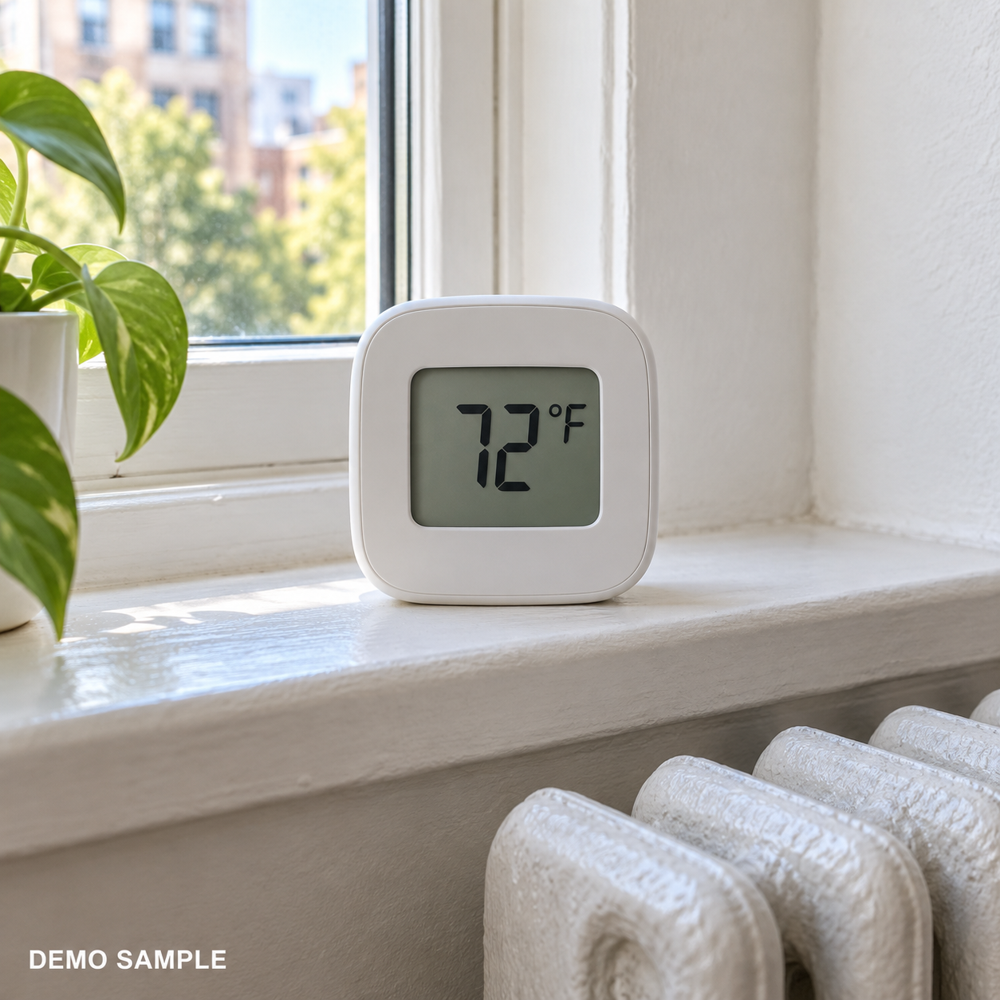

  

# RentEscrow

- **Document the issue. Coordinate the repair. Keep rent accountable.**
- Built for **Columbia DivHacks 2026**, September 26–27 at Columbia University.
- **[Live application →](https://divhacks1-production.up.railway.app)**

## What it does

- **Organizes repair disputes:** Keeps evidence, messages, expenses, building records, and repair progress in one case.
- **Connects tenants and landlords:** Provides separate workspaces and iMessage agents for repair updates and scheduling.
- **Analyzes evidence:** Uses Gemini to extract observations from photos and PDFs, supporting before-and-after repair review.
- **Makes financial decisions traceable:** Combines signed agreement policies, account verification, payment limits, and recorded settlement results.
- **Keeps records accessible:** Persists case history and lets tenants export a case dossier.

## DivHacks tracks

- **Hack The City:** Makes NYC housing information actionable by connecting public building complaints and violations to tenant repair cases.
- **Capital One — The Best Use of Nessie:** Verifies sandbox customer/account relationships and retrieves balances, rent history, and transactions for tenant review.
- **Ripple — Best Agentic Finance Infrastructure on XRPL:** Supports autonomous Testnet settlement under signed agreement policies, with fixed destinations, spending limits, replay protection, and transaction verification.
- **Photon — Agents in iMessage using Photon:** Uses Spectrum to connect tenant and landlord conversations with agents that interpret and relay repair updates.
- **MLH — Best Use of Gemini API:** Produces structured evidence observations and interprets repair messages. Payment authority stays in server-side policy rules.
- **MLH — Best Use of MongoDB Atlas:** Stores accounts, sessions, cases, agreements, audit records, and uploaded evidence through GridFS.

## High-level system design

- **Repair flow:** Report issue → upload evidence → coordinate repairs → review completion → evaluate settlement conditions.
- **Payment controls:** Verify signed authority, case bindings, balances, destinations, and duplicate protection before signing a transaction.
- **Messaging boundary:** Conversation agents coordinate repairs; they cannot replace approved wallets, amounts, or financial authority.

## Tech stack

- **Frontend:** Next.js 16, React 19, TypeScript, custom CSS, and Lucide icons.
- **Backend:** Node.js 22+, Next.js API routes, Zod validation, and role-based authentication.
- **Storage:** MongoDB Atlas and GridFS.
- **Integrations:** Gemini API, Spectrum SDK, Capital One Nessie, NYC Open Data, and `xrpl.js`.
- **Deployment and testing:** Railway, pnpm, Node.js test runner, and Playwright.

## Demo evidence

  
  

- Synthetic sample images demonstrate the **54°F → 72°F** repair comparison.
- Sample results are labeled separately from live Gemini analysis.

## Run locally

- Install **Node.js 22+** and **pnpm 11.25.0**.
- Run `pnpm install --frozen-lockfile`.
- Use `.env.example` to configure an ignored `.env.local`, including MongoDB credentials.
- Run `pnpm seed:users`, then `pnpm dev`.
- Open `http://127.0.0.1:3000`.
- For configured iMessage integration, run `pnpm agent` in a separate terminal.
- Validate with `pnpm typecheck`, `pnpm test`, and `pnpm build`.

## Prototype scope

- Application USD escrow is simulated; Nessie provides mock banking data.
- XRPL settlement uses Testnet tokens with no monetary value.
- AI observations support review. Signed policies and deterministic server checks govern settlement.
