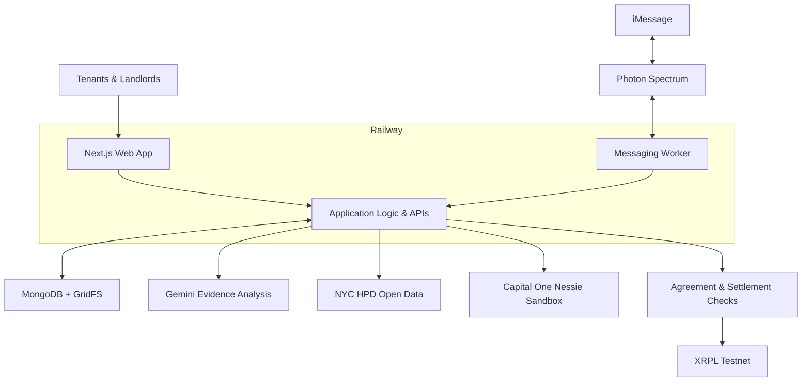

  

# RentEscrow
**Document the problem. Coordinate the repair. Track the resolution.**

- Built at **Columbia DivHacks 2026**.
- Helps tenants and landlords manage repair evidence, communication, and conditional settlement workflows.
- **[Open RentEscrow](https://divhacks1-production.up.railway.app)**

## The Problem

- A broken sink can turn into weeks of unanswered messages and scattered photos.
- RentEscrow brings repair requests, supporting evidence, and updates into one shared case.

  

*Illustrative repair image from [OX Plumbing](https://oxplumbing.com/).*

## What It Does

- **Tenant and landlord dashboards:** Manage cases and follow repair progress.
- **Evidence uploads:** Keep photos, documents, and timestamps together.
- **AI assistance:** Use Gemini to interpret uploaded evidence and summarize observations.
- **iMessage coordination:** Exchange repair updates through a Photon Spectrum messaging agent.
- **NYC housing context:** Surface public HPD complaint and violation records.
- **Conditional settlements:** Connect signed agreements and application checks to XRPL Testnet payment workflows.

## DivHacks Tracks & Integrations

- **Hack The City — General track alignment:** Make housing repair information and coordination more accessible.
- **Capital One — Best Use of Nessie:** Use sandbox banking data for account verification, balances, and rent history.
- **Ripple — Best Agentic Finance Infrastructure on XRPL:** Support policy-controlled RLUSD settlement workflows on XRPL Testnet.
- **Photon — Agents in iMessage:** Coordinate tenant and landlord repair conversations through iMessage.
- **MLH — Best Use of Gemini API:** Analyze evidence and produce useful observations for case review.
- **MLH — Best Use of MongoDB Atlas:** Persist accounts, sessions, cases, agreements, and audit records.

## High-Level System Design

## Tech Stack

- **Frontend:** Next.js 16, React 19, TypeScript, custom CSS, and Lucide icons.
- **Backend:** Next.js server routes, Node.js, and Zod validation.
- **Storage:** MongoDB for application records and GridFS for uploaded evidence.
- **AI & messaging:** Gemini API and Photon Spectrum.
- **Finance integrations:** Capital One Nessie and the XRPL JavaScript SDK.
- **Deployment:** Railway web service and a separate messaging worker.

## Prototype Scope

- Built as a hackathon prototype using banking sandbox data and XRPL Testnet.
- In-app USD escrow balances are simulated.
- AI observations support review; settlement decisions follow application rules and signed agreement permissions.
